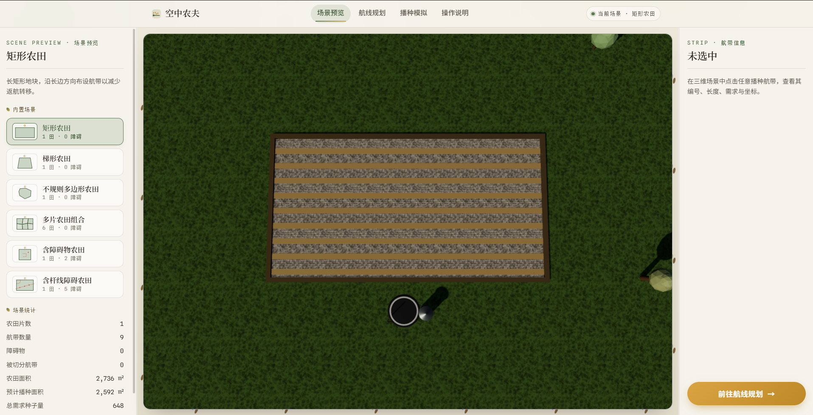
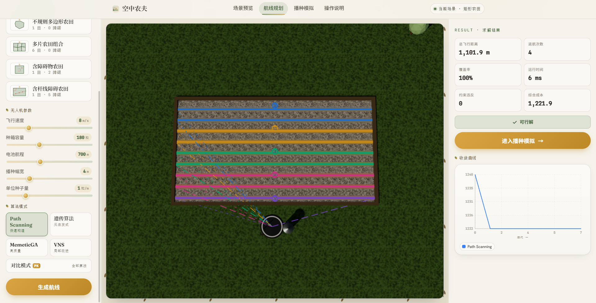
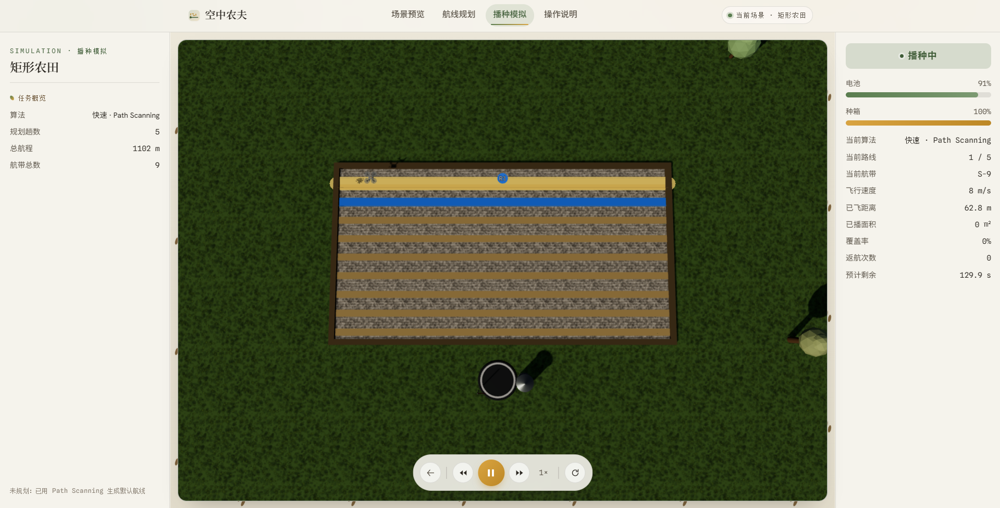

# 空中农夫 AirFarmer

> 《NP 复杂性与近似算法》课程作业：基于带容量约束弧路径问题（CARP）的无人机播种航线规划与三维仿真系统。

AirFarmer 将农田中的播种航带建模为 CARP 的必服务边，在种箱容量、电池航程、返航补给和障碍物安全区等约束下，使用启发式与元启发式算法生成无人机航线。系统提供场景预览、算法对比、收敛曲线和三维播种仿真，用于展示从问题建模、近似求解到结果验证的完整过程。

## 项目功能

- 根据多边形农田边界和播种幅宽自动生成平行航带；
- 支持点状、线状和多边形障碍物，并按安全缓冲区切分航带；
- 支持种箱容量和单趟最大航程约束，自动插入返航补给；
- 内置 Path Scanning、遗传算法、VNS 和 MemeticGA 四种求解器；
- 对比总航程、返航次数、覆盖率、运行时间和综合成本；
- 使用 Web Worker 执行求解，避免规划过程阻塞界面；
- 使用 Three.js 展示飞行、播种、避障、返航和补给过程；
- 同时支持浏览器运行和 Tauri 桌面端打包。

## 系统界面

### 首页


### 场景预览



### 航线规划



### 播种模拟



## 问题建模

设无向图为 $G=(V,E)$，其中补给点为 $v_0$，待播种航带集合 $R\subseteq E$。每条航带 $e_i$ 具有服务成本 $c_i$ 和种子需求 $q_i$。无人机执行多趟从 $v_0$ 出发并返回 $v_0$ 的路线 $P_k$。

基本目标是最小化完成全部播种任务的总成本：

$$
\min \sum_k C(P_k)
$$

每趟路线需同时满足种箱容量和电池航程约束：

$$
\sum_{e_i\in P_k\cap R}q_i\le Q,\qquad C(P_k)\le B
$$

当前实现使用以下综合目标函数评价候选解：

$$
f=\text{distance}+30\times\text{returns}+5000\times\text{violations}+5000\times\text{missing}
$$

其中 `violations` 为容量或航程约束违反数，`missing` 为未服务航带数。解码器会修复非法或重复的航带编号，并将航带序列切分为满足约束的多趟路线。

CARP 属于 NP-hard 问题。随着航带数量增加，精确求解的计算成本迅速增长，因此本项目采用启发式和元启发式算法，在交互式运行时间内寻找高质量可行解。

## 求解算法

| 算法 | 核心思路 | 适用场景 |
| --- | --- | --- |
| Path Scanning | 使用多种扫描规则快速构造可行航带顺序 | 快速预览、生成基线解 |
| Genetic Algorithm | 通过选择、顺序交叉、变异和精英保留执行全局搜索 | 标准优化 |
| VNS | 在 swap、insertion、inversion、relocate 和 exchange 邻域中局部改进 | 优化已有可行解 |
| MemeticGA | 将遗传算法与轻量 VNS 局部搜索结合 | 追求更高质量的解 |

“算法对比”模式依次执行四种算法。VNS 从 Path Scanning 与 GA 的较优结果开始搜索，MemeticGA 则使用前三种算法的结果初始化高质量个体。

## 内置场景

项目包含 6 类场景：

1. 矩形农田；
2. 梯形农田；
3. 不规则多边形农田；
4. 多片农田组合；
5. 含矩形禁飞区和点状障碍的农田；
6. 含电线杆、架空电力线和水塘的农田。

默认无人机参数为：速度 `8`、种箱容量 `180`、最大航程 `700`、单位长度种子消耗 `1`、播种幅宽 `4`。在规划页修改播种幅宽或播种率后，系统会重新生成航带及其需求量。

## 技术栈

- React 18、TypeScript、Vite；
- Three.js、React Three Fiber、Drei；
- Zustand；
- KaTeX；
- Vitest；
- Tauri 2、Rust。

## 快速开始

### 环境要求

- Node.js 20 或更高版本；
- npm；
- 仅在运行或构建桌面端时需要 Rust 和 Tauri 对应的平台依赖。

### 浏览器运行

```bash
npm ci
npm run dev
```

打开终端中 Vite 输出的地址，通常为 `http://localhost:5173`。

生产构建与本地预览：

```bash
npm run build
npm run preview
```

### 桌面端运行

安装 Rust 和 Tauri 平台依赖后执行：

```bash
npm ci
npm run tauri:dev
```

构建桌面安装包：

```bash
npm run tauri:build
```

## 使用流程

1. 在“场景预览”中选择农田，查看边界、航带和障碍物；
2. 进入“航线规划”，设置速度、种箱容量、最大航程、播种率和播种幅宽；
3. 选择单个算法或“算法对比”模式并生成航线；
4. 检查覆盖率、约束状态、总航程、返航次数和收敛曲线；
5. 进入“播种模拟”，播放无人机的飞行与播种过程。

若未提前规划，播种模拟页会自动使用 Path Scanning 生成默认航线。

## 测试与质量检查

```bash
# 类型检查
npm run typecheck

# 单元测试
npm test -- --testTimeout=15000

# 生产构建
npm run build
```

测试覆盖所有内置场景和四种求解器，主要验证：

- 每条航带恰好服务一次；
- 覆盖率为 100%；
- 每趟路线满足容量和航程约束；
- 目标函数与返航次数计算正确；
- GA 和 MemeticGA 在相同随机种子下输出稳定；
- 仿真避障方向保持稳定。

多片农田场景中的 VNS 用例计算时间可能超过 Vitest 默认的 5 秒，因此测试命令显式设置为 15 秒。

## 项目结构

```text
AirFarmer/
├─ docs/                 # 课程报告与算法移植说明
├─ src/
│  ├─ algorithms/        # 解码器、Path Scanning、GA、VNS、MemeticGA
│  ├─ components/        # 页面组件、规划面板和仿真控制台
│  ├─ geometry/          # 多边形、距离、航带生成与障碍切分
│  ├─ pages/             # 首页、场景、规划、仿真和操作说明
│  ├─ scenarios/         # 内置场景定义与场景工厂
│  ├─ simulation/        # 仿真状态、运动与避障逻辑
│  ├─ store/             # 全局应用状态
│  ├─ three/             # 三维场景和路线渲染
│  └─ types/             # CARP 领域模型
├─ src-tauri/            # Tauri 桌面端配置与 Rust 入口
├─ package.json
└─ vite.config.ts
```

## 课程资料

- [课程项目报告](docs/main.tex)
- [算法 TypeScript 移植说明](docs/algorithm_porting_to_typescript.md)

## AI 工具使用说明

本项目在设计、开发、调试和文档整理过程中使用了多种 AI 工具，各模型的主要分工如下：

| AI 模型 | 主要工作 |
| --- | --- |
| Claude Opus 4.8 | 前端界面开发、3D 场景建模及高级 Bug 修复 |
| GPT-5.5 | 前期调研与头脑风暴、底层算法设计与实现、`docs` 文档撰写及高级 Bug 修复 |
| GPT Image 2 | 生成软件 Logo |
| GLM 5.2 | 前端视觉美化与样式优化 |
| DeepSeek V4 Flash | 常规问题排查与低级 Bug 修复 |
| MiMo V2.5 | 基于 Tauri 2 打包桌面应用 |

## 作者

朱华天  
《NP 复杂性与近似算法》课程作业，2026 年 6 月。
